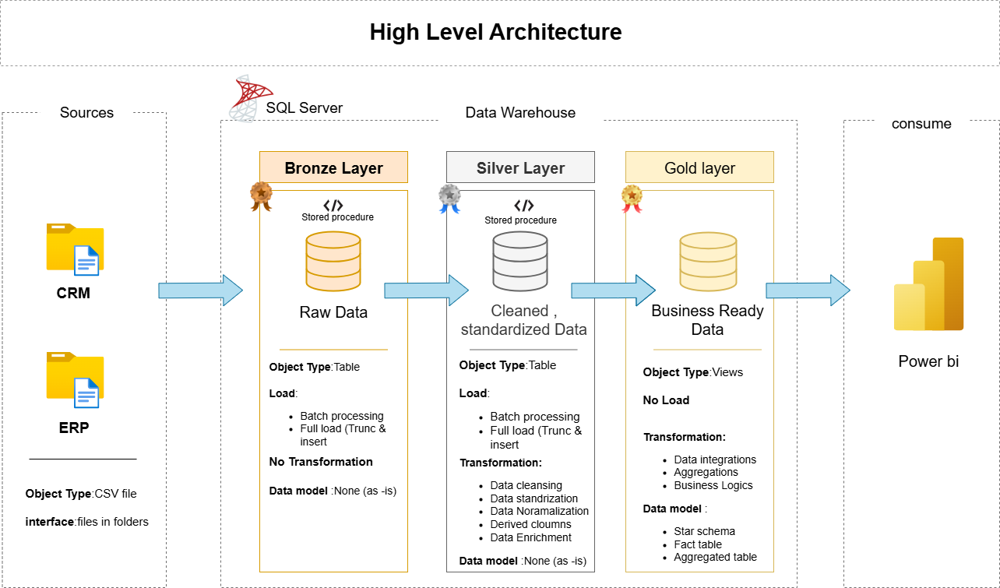

# 📊 SQL Data Warehouse Project

Build a modern data warehouse using SQL Server, including **ETL processing**, **data modeling**, and **analytics**.

Welcome to the **Data Warehouse and Analytics Project** repository.  
This project demonstrates a complete data warehousing solution—from ingesting raw data to generating insightful reports—following **industry best practices**.

---

## 🧱 Data Architecture

The project adopts the **Medallion Architecture** pattern:



- **Bronze Layer**: Stores raw data as-is from the source systems (CSV files to SQL Server).
- **Silver Layer**: Cleansed, standardized, and normalized data prepared for analysis.
- **Gold Layer**: Business-ready data modeled into a star schema for reporting.

---

## 🚀 Project Scope

This project includes:

- ✅ **Data Architecture**: Medallion Architecture (Bronze, Silver, Gold)
- ✅ **ETL Pipelines**: Extract, transform, and load data from source CSV files
- ✅ **Data Modeling**: Design of fact and dimension tables for analytical performance
- ✅ **SQL-Based Analytics**: Write reports for business insights

---

## 🎯 Target Audience

This repository is ideal for:

- SQL Developers
- Data Engineers
- ETL Pipeline Developers
- Data Analysts
- Data Architects

---

## 🧰 Tools & Resources

- `CSV Datasets`: ERP & CRM data
- `SQL Server Express`: Lightweight database
- `SSMS`: SQL Server Management Studio
- `DrawIO`: Design architecture diagrams
- `Notion`: Access full project template and steps
- `Git`: Version control and collaboration

---

## 📌 Project Requirements

### 🏗️ Data Engineering

**Objective**: Build a data warehouse that consolidates ERP and CRM sales data to support analytics.

**Requirements**:
- Import data from CSV files
- Clean data and fix quality issues
- Combine both sources into one analytical model
- Document model clearly
- No historization required

---

### 📊 Analytics & Reporting

**Objective**: Create SQL reports with insights on:

- Customer Behavior
- Product Performance
- Sales Trends

---

## 📂 Repository Structure

```plaintext
data-warehouse-project/
│
├── datasets/                           # Raw datasets used for the project (ERP and CRM data)
│
├── docs/                               # Project documentation and architecture details
│   ├── etl.drawio                      # Draw.io file shows ETL techniques
│   ├── data_architecture.drawio        # Draw.io file of architecture design
│   ├── data_catalog.md                 # Dataset field descriptions
│   ├── data_flow.drawio                # Data flow diagram
│   ├── data_models.drawio              # Star schema models
│   ├── naming-conventions.md           # Naming rules for DB objects
│
├── scripts/                            # SQL scripts for ETL and transformations
│   ├── bronze/                         # Extract and load raw data
│   ├── silver/                         # Clean and transform data
│   ├── gold/                           # Analytical model queries
│
├── tests/                              # Test scripts and data quality checks
│
├── README.md                           # Project overview
├── LICENSE                             # License details
├── .gitignore                          # Git ignored files
└── requirements.txt                    # Project dependencies
